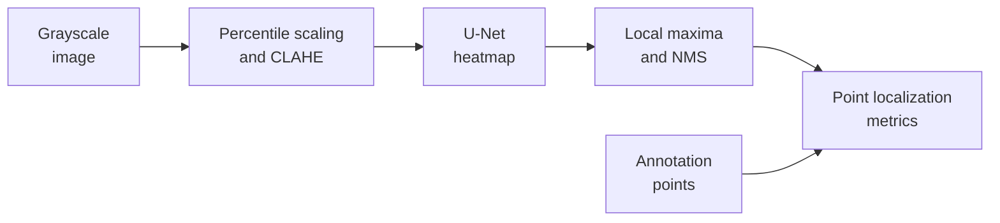

# Pore Localization and Synthetic-to-Real Feasibility

A computer vision research project on locating fingerprint pores from image
annotations. It combines data and label audits, a U-Net trained from scratch,
point-level evaluation, and a frozen transfer study on real fingerprint scans.
The engineering contribution is the measured pipeline and its evidence trail.

**Status:** Experiment 004 completed on 29 August 2026. Further experiments are
paused. The repository remains public for inspection of the implementation and
results.

## Result and its boundary

On the synthetic test split, median **F1@4 = 0.9776** across three training seeds,
compared with **0.7788** for the experiment's classical baseline: an absolute
difference of **0.1988**, or **19.88 percentage points** on the F1 scale.

**Transfer to real SD300 scans remains inconclusive.** Valid mated registrations
covered **0/20 pairs at 1000 PPI** and **2/20 at 2000 PPI**. Preprocessing failures
and a limitation of the non-mated control prevented estimation of the intended
transfer effect. This does not establish that the detector itself cannot
generalize.

| Decision | Recorded outcome | Scope |
| --- | --- | --- |
| Gate A | `STRONG_PASS` | Localization against synthetic annotations |
| Gate B | `TRANSFER_INCONCLUSIVE` | Frozen SD300 transfer assessment |
| Final | `SYNTHETIC_LOCALIZATION_ONLY` | No demonstrated recognition improvement |

F1@4 measures one-to-one agreement between predicted and annotated points within
4 pixels. Each seed's score pools point counts across the **same 150 test
images**; the headline is the median of those three scores. It is not fingerprint
identification accuracy. Missing transfer estimates remain `null`, not zero.

Read the [English case study](docs/case-study.md) for the method, all seed results,
and the transfer diagnosis. Sources: [test metrics](artifacts/experiment-004/test_metrics.json),
[baseline metrics](artifacts/experiment-004/baseline_metrics.json),
[transfer summary](artifacts/experiment-004/sd300_transfer_summary.json), and
[final decision](artifacts/experiment-004/summary.json).

## Pipeline



The diagram describes supervised synthetic localization. SD300 adds ridge-scale
normalization, tiled inference, and registration for a separate repeatability
assessment. Point-to-annotation assignment is an evaluation step, not an identity
matcher. No fingerprint images, heatmaps, or reconstructable visual outputs are
published here as examples.

## What was built

- **Data controls:** audited annotation coordinates and exact duplicates, then
  split by `pattern + local_index`, keeping all five dataset runs together.
  The [split manifest](artifacts/experiment-004/split_manifest.json) records
  440/150/150 train/validation/test images in 88/30/30 leakage groups.
- **Training:** a four-level U-Net with GroupNorm and **7,240,225 parameters**,
  Gaussian heatmap targets, aligned image/point augmentation, and validation-loss
  checkpoint selection. The same architecture and split were used for all seeds.
- **Point extraction and measurement:** deterministic local maxima, non-maximum
  suppression (NMS), optimal one-to-one assignment, and pooled precision/recall/F1.
  Thresholds, NMS, and the local bright-extrema baseline were selected on
  validation and frozen before test access.
- **Execution and evidence:** epoch-boundary resume state, retained interrupted
  attempts, cached preprocessing to address runtime compatibility, and manifests
  binding local outputs to configurations and hashes.
- **Transfer controls:** frozen preprocessing and registration validity checks,
  with explicit unavailable results when the planned comparison cannot be made.

Implementation: [data, points, and metrics](src/fingerprint_new_method/experiment004.py),
[model and training](src/fingerprint_new_method/experiment004_model.py),
[transfer measurement](src/fingerprint_new_method/experiment004_transfer.py).
The architecture follows the [U-Net family](https://arxiv.org/abs/1505.04597);
this work does not claim a new architecture or superiority over external systems.

## Data scope

Training and synthetic evaluation used **740 annotated 512 × 512 images** from
[L3-SF](https://andrewyzy.github.io/L3-SF/), specifically `annotated_512`.
The separate **7,400-image `final_320` branch was not used**: Experiment 003 did
not establish an approved mapping between the branches. Pixel dimensions alone
do not establish a physical sensor PPI for the synthetic images.

SD300 provides real scanned fingerprint cards for the transfer study. The 1000-
and 2000-PPI scans are related views, not independent populations. Neither
anatomical pore accuracy on SD300 nor identity verification, liveness, or
production readiness was established.

## Start with the evidence and software checks

The [case study](docs/case-study.md) and tracked JSON summaries can be read without
datasets, checkpoints, or a GPU. The existing tests use small synthetic fixtures
and compact repository evidence; they do not run the research experiments.

With the existing Windows Python 3.12 environment, run from the repository root:

```powershell
& .\.conda-env\python.exe -m pip check
& .\.conda-env\python.exe -m pytest -q
& .\.conda-env\Scripts\ruff.exe check .
& .\.conda-env\python.exe -m compileall -q src scripts tests
```

See [CONTRIBUTING.md](CONTRIBUTING.md) for the check and PR workflow. For a fresh
Windows setup, [the bootstrap script](scripts/bootstrap_environment.ps1) uses the
committed [Conda lock](conda-lock.yaml); [environment.yml](environment.yml) records
dependency intent. Keep research dependencies out of Conda `base`.

[CI](.github/workflows/ci.yml) runs the dataset-independent checks on Linux with
Python 3.12 and the package's development dependencies. PyTorch is optional for
those checks. CI does not validate CUDA training, recover private outputs, or
establish numerical equivalence across hardware.

Historical training and inference additionally require separately held datasets,
local caches/checkpoints, and the recorded PyTorch runtime. Source data remains
external and read-only, resolved through `FINGERPRINT_DATASETS_ROOT` or the sibling
`fingerprint-datasets` directory. [Artifact regeneration commands](artifacts/README.md)
document the completed experiments; they are not the getting-started workflow.

## Evidence map

Historical reports are in Hebrew; the [case study](docs/case-study.md) is the
English reading path.

| Experiment | Question | Evidence |
| --- | --- | --- |
| 001 | Are fine details visible and repeatable in real scans? | [Protocol](docs/experiments/001-sd300-level3-feasibility-preregistered-selection.md) · [Results](docs/experiments/001-sd300-level3-feasibility-results.md) |
| 002 | Are the synthetic annotations usable for localization? | [Results](docs/experiments/002-l3sf-pore-annotation-feasibility-results.md) |
| 003 | Can annotated and final synthetic branches be mapped? | [Protocol](docs/experiments/003-l3sf-annotated-final-crosswalk-protocol.md) · [Results](docs/experiments/003-l3sf-annotated-final-crosswalk-results.md) |
| 004 | Can a trained localizer support a real-data transfer assessment? | [Protocol](docs/experiments/004-pore-localization-and-sd300-transfer-protocol.md) · [Results](docs/experiments/004-pore-localization-and-sd300-transfer-results.md) · [Exploratory amendment](docs/experiments/004-scale-guard-contingency-amendment.md) |

These are historical results with their own protocol and output identities.
Documentation updates do not imply that experiments ran on the latest commit.

## Attribution and rights

This is a public research repository with **all rights reserved** under
[LICENSE](LICENSE), not an open-source license grant. The
`Private :: Do Not Upload` package classifier prevents PyPI publication;
it does not describe GitHub visibility ([PyPA guidance](https://packaging.python.org/en/latest/guides/writing-pyproject-toml/#classifiers)).

L3-SF is credited to André Brasil Vieira Wyzykowski, Mauricio Pamplona Segundo,
and Rubisley de Paula Lemes. Dataset terms remain separate from repository rights.
See [data and licensing](docs/data-and-licensing.md),
[artifact policy](artifacts/README.md), and [citation metadata](CITATION.cff).
